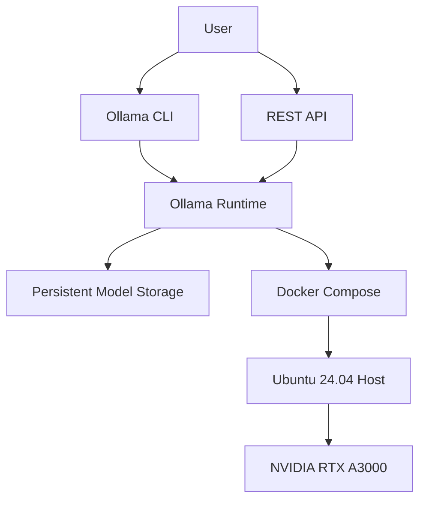

# Architecture

## Purpose

This document defines the architectural foundation for Local AI Platform. It establishes the principles, goals, and direction that should guide future implementation decisions.

## Architectural Principles

- Keep platform boundaries explicit and understandable.
- Prefer modular components with clear responsibilities.
- Avoid premature abstraction and unnecessary framework commitments.
- Document decisions that affect system behavior, extensibility, or operations.
- Preserve local-first operation as a primary design constraint.

## Design Goals

The platform should be maintainable, observable, and adaptable as capabilities are added. Core services should be designed around stable responsibilities rather than transient implementation details. Integration points should remain clear enough to support future model runtimes, orchestration patterns, and operational workflows.

## High-Level Vision

The Local AI Platform is designed as a layered system with clear separation of responsibilities. Users interact with the platform through either the CLI or REST API, both of which communicate with a single Ollama runtime. The runtime manages AI models stored on persistent host storage while running inside a Docker Compose environment on an Ubuntu host with NVIDIA GPU acceleration.

## Current Phase

The project is currently in the repository foundation phase. The priority is to establish documentation, repository hygiene, and architectural alignment before implementation begins.

## Future Direction

Future work should define the platform's core domains, service boundaries, runtime model, and operational expectations. As implementation begins, architecture documentation should expand to capture decisions, tradeoffs, and constraints that shape the system over time.
